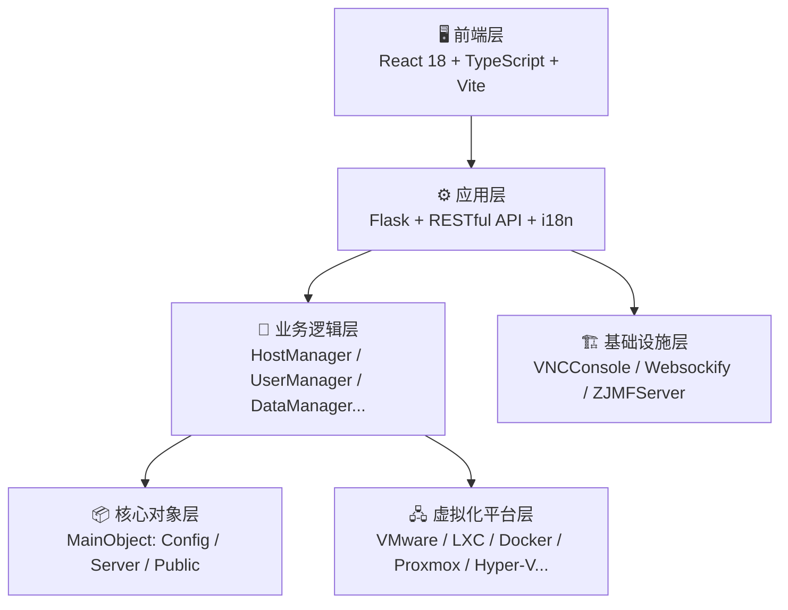
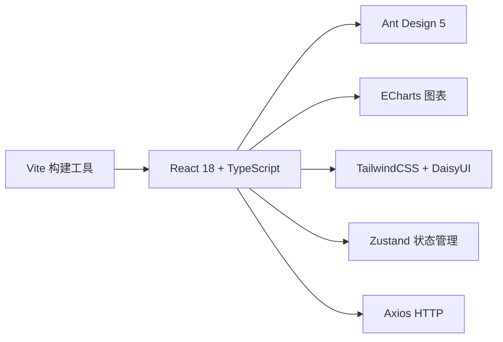
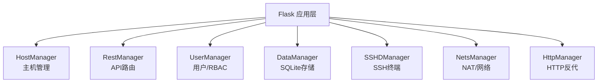
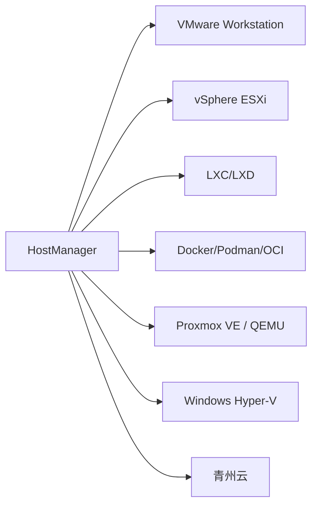

# OpenIDC-Client 开源IDC虚拟化统一管理平台

<p align="center">
  <strong>使用统一Web界面和RESTful API来管理多虚拟化平台的虚拟机基础设施</strong><br>
  <em>支持VMware、LXC、Docker等多种虚拟化技术，提供企业级虚拟机生命周期管理</em>
</p>

<p align="center">
  <a href="https://github.com/OpenIDCSTeam/HostAgent"></a>
  <a href="https://github.com/OpenIDCSTeam/HostAgent"></a>
  <a href="https://github.com/OpenIDCSTeam/HostAgent/issues"></a>
  <a href="https://github.com/OpenIDCSTeam/HostAgent/blob/main/LICENSE"></a>
</p>
<p align="center"><a href="ProjectDoc/APIDOC_ALL.md">📚 API文档</a> | <a href="ProjectDoc/DEPLOYMENT.md">🚀 部署指南</a> | <a href="ProjectDoc/PROJECT_OVERVIEW.md">🏗️ 项目架构</a></p>


## 🎯 项目概述

OpenIDC-Client是一个开源的IDC（Internet Data Center）虚拟化统一管理平台，旨在简化多虚拟化环境下的虚拟机管理工作。它提供了一个统一的Web管理界面和完整的RESTful API，让运维人员可以轻松地管理分布在多个虚拟化平台上的虚拟机集群。

<p align="center">
  
  
  
</p>

---


### 🌟 核心特性

#### 📖 适用场景

| 场景 | 说明 |
|------|------|
| 🏢 **中小企业IT** | 统一管理开发、测试、生产环境虚拟机 |
| ☁️ **私有云运维** | 作为私有云平台的轻量级管理前端 |
| 🎓 **教育培训** | 为实验室或培训中心提供虚拟机资源共享 |
| 🔬 **研发团队** | 管理开发测试环境的虚拟机集群 |
| 🏭 **IDC转型** | 帮助传统IDC服务商快速提供虚拟化服务 |

#### 平台支持

| 平台                 | 状态    | 受控端支持的操作系统            | 架构            |
|--------------------|-------|-----------------------|---------------|
| LXC/D Environments | ✅ 已实现 | Windows, Linux        | x86_64, ARM64 |
| Docker/Podman/K8SC | ✅ 已实现 | Windows, Linux, macOS | x86_64, ARM64 |
| VMware Workstation | ✅ 已实现 | Windows               | x86_64        |
| Proxmox VE Runtime | ✅ 已实现 | Windows, Linux        | x86_64, ARM64 |
| VMware vSphere ESX | ✅ 已实现 | Windows, Linux, macOS | x86_64, ARM64 |
| Windows Hypervisor | ✅ 已实现 | Windows               | x86_64        |
| Oracle Virtual Box | 🚧 开发中 | Windows, Linux        | x86_64, ARM64 |
| QEMU & KVM Machine | 🚧 开发中 | Windows, Linux, macOS | x86_64, ARM64 |
| MEmu Game Emulator | 🚧 开发中 | Windows               | x86_64        |

#### 功能支持

| 方法名 | 功能描述 | VMware | LXC |  OCI   | PVE | HyperV | ESXi  | Qingzhou |
|--------|----------|:------:|:-----------:|:------:|:---:|:------:|:-----:|:-----------:|
| `VMPasswd` | 改密 |   ✅    | ✅外部 |  ✅外部   |  ✅  |   ✅    |   ✅   | ✅ |
| `VMScreen` | 截图 |   ✅    | ❌ 不支持 | ❌ 不支持  |  ✅  |   ✅    |   ✅   | ✅ |
| `VMBackup` | 备份 |   ✅    | ✅ |   ✅    |  ✅  |   ✅    |   ✅   | ✅ |
| `Restores` | 还原 |   ✅    | ✅ |   ✅    |  ✅  |   ✅    |   ✅   | ✅ |
| `LDBackup` | 列出备份 |   ✅    | ✅ |   ✅    | ⚠️  |   ✅    |   ✅   | ✅ |
| `RMBackup` | 删除备份 |   ✅    | ✅ |   ✅    | ⚠️  |   ✅    |   ✅   | ✅ |
| `HDDMount` | 挂载磁盘 |   ✅    | ✅ |   ✅    |  ✅  |   ✅    |   ✅   | ✅ |
| `ISOMount` | 挂载ISO |   ✅    | ❌  不支持 |   ✅    |  ✅  |   ✅    |   ✅   | ✅ |
| `RMMounts` | 卸载磁盘 |   ✅    | ✅ |   ✅    |  ✅  |   ✅    |   ✅   | ✅ |
| `HDDCheck` | 磁盘检查 |   ✅    | ❌ |   ❌    |  ✅  |   ❌    |   ✅   | ❌ |
| `HDDTrans` | 磁盘迁移 |   ✅    | ❌  不支持 | ❌  不支持 |  ✅  | ❌ 不适用  | ❌ 无方法 | ❌ 不适用 |
| `PCIShows` | 列出PCI | ❌ 不支持  | ❌ 不支持 |   ✅    |  ✅  |   ✅    |   ✅   | ✅ |
| `PCISetup` | 配置PCI |   ✅    | ❌ |   ❌    |  ✅  |   ✅    |   ✅   | ❌ 不适用 |
| `USBShows` | 列出USB |   ✅    | ❌ |   ❌    |  ✅  |   ❌    |   ✅   | ❌ |
| `USBSetup` | 配置USB |   ✅    | ❌ |   ❌    |  ✅  |   ❌    |   ✅   | ❌ 不适用 |


#### 功能优势

| 功能模块 | 核心能力 |
|----------|----------|
| 🖥️ **虚拟机生命周期** | 创建/配置/启动/停止/重启/删除；实时状态监控；快照备份与一键还原；动态调整 CPU、内存、存储 |
| 🌐 **网络与安全** | 智能 IP 分配管理；NAT 端口转发；Web 反向代理；iptables 防火墙规则；SSH 终端直连 |
| 👥 **多租户用户管理** | 基于角色的访问控制（RBAC）；细粒度权限（创建/修改/删除）；资源配额限制（CPU/内存/存储/流量） |
| 📊 **监控与运维** | 实时主机与虚拟机性能监控；资源使用可视化；完整操作日志；定时任务调度 |
| 🔌 **远程访问** | 基于 Web 的 VNC 控制台；无需安装客户端；SSL 加密安全连接 |
| 💾 **存储管理** | 虚拟磁盘挂载/卸载；ISO 镜像管理；数据备份与迁移 |

---

## 🚀 快速开始

### Linux 一键安装（推荐）

```bash
curl -fsSL https://raw.githubusercontent.com/OpenIDCSTeam/HostAgent/main/install.sh | sudo bash
```

安装完成后使用 `openidcs` 命令管理服务：

```bash
sudo openidcs start        # 启动服务
sudo openidcs stop         # 停止服务
sudo openidcs restart      # 重启服务
sudo openidcs status       # 查看运行状态
sudo openidcs update       # 更新到最新版本
sudo openidcs uninstall    # 卸载程序
sudo openidcs log          # 查看实时日志
sudo openidcs service enable   # 设置开机自启
```

> 如需源码安装（开发用途），请使用：
> ```bash
> curl -fsSL https://raw.githubusercontent.com/OpenIDCSTeam/HostAgent/main/install.sh | sudo bash -s -- --source
> ```

### Windows 下载运行

1. **下载构建二进制**：[Releases · OpenIDCSTeam/HostAgent](https://github.com/OpenIDCSTeam/HostAgent/releases)
2. **运行二进制**：`OpenIDCS-Client`

### 访问后端

1. **登录系统**: 打开浏览器访问: http://localhost:1880
2. **添加主机**: 进入"主机管理"添加VMware Workstation等主机
3. **配置网络**: 设置IP地址池和NAT规则
4. **创建用户**: 为团队成员创建账户并分配权限
5. **开始管理**: 创建和管理您的虚拟机

注意：
- 首次启动会自动生成访问Token，请查看控制台输出
- 使用Token登录或创建管理员账户

---


## 🛠️ 开发贡献

### 环境要求

- **操作系统**: Windows 10/11, Linux (Ubuntu 18.04+, CentOS 7+), macOS 10.14+
- **Python**: 3.8 或更高版本
- **内存**: 最少 4GB RAM（推荐 8GB+）
- **存储**: 最少 2GB 可用空间
- **网络**: 能够访问虚拟化平台的管理接口

### 开发部署

#### 克隆项目
```bash
git clone https://github.com/OpenIDCSTeam/HostAgent.git
cd HostAgent

```

#### 创建环境
```bash
python -m venv venv
source venv/bin/activate  # Linux/Mac
venv\Scripts\activate     # Windows
```

#### 安装依赖
```bash
pip install -r HostConfig/pipinstall.txt
```

#### 启动后端
```bash
python HostServer.py
```

#### 前端开发

```bash
cd FrontPages
npm install
npm run dev

# 前端生产构建
npm run build
```

### 构建分发

| 方式 | 命令 |
|------|------|
| Nuitka（推荐，Windows） | `cd AllBuilder && build_nuitka.bat` |
| Nuitka（Linux/Mac） | `cd AllBuilder && ./build_nuitkaui.sh` |
| cx_Freeze | `python HostBuilds.py build` |

欢迎通过 Issue、Pull Request、文档完善或测试反馈等方式参与贡献。

---


## 🏗️ 技术架构

### 整体架构



### 前端技术



### 业务逻辑



### 平台支持



### 技术栈

| 层级 | 技术组件 | 版本要求 |
|------|----------|----------|
| **前端框架** | React 18 + TypeScript | >= 18.2.0 |
| **前端构建** | Vite | >= 7.0.0 |
| **UI组件库** | Ant Design 5 | >= 5.12.0 |
| **样式** | TailwindCSS + DaisyUI | >= 3.4.0 |
| **图表** | ECharts + echarts-for-react | >= 5.4.3 |
| **状态管理** | Zustand | >= 4.4.7 |
| **HTTP客户端(前端)** | Axios | >= 1.6.2 |
| **后端** | Python Flask | >= 2.3.3 |
| **数据库** | SQLite | - |
| **日志** | Loguru | >= 0.6.0 |
| **HTTP客户端(后端)** | Requests | >= 2.28.0 |
| **系统监控** | psutil/GPUtil/py-cpuinfo | >= 5.9.0 |
| **压缩工具** | py7zr | >= 0.20.0 |
| **SSH** | Paramiko | - |
| **WinRM** | pywinrm | - |
| **虚拟化** | pyvmomi/pylxd/docker/proxmoxer | 可选依赖 |
| **打包** | Nuitka/cx_Freeze | >= 1.8.0 |


## 项目结构

```
OpenIDC-Client/
├── 📁 FrontPages/              # React前端（TypeScript + Vite）
│   ├── src/
│   │   ├── pages/              # 页面组件（Dashboard、HostManage、DockDetail等）
│   │   ├── components/         # 公共组件
│   │   ├── utils/              # API封装、axios、i18n多语言
│   │   ├── config/             # 主题配置
│   │   └── types/              # TypeScript类型定义
│   ├── package.json            # 前端依赖（React/Antd/ECharts/Tailwind）
│   └── vite.config.ts          # Vite构建配置
├── 📁 HostServer/              # 虚拟化平台驱动层
│   ├── BasicServer.py          # 基础服务器抽象类
│   ├── OCInterface.py          # Docker/OCI容器接口
│   │   └── OCInterfaceAPI/     # OCI子模块（IPTables、端口转发、SSH终端）
│   ├── LXContainer.py          # LXC/LXD容器接口
│   ├── Workstation.py          # VMware Workstation接口
│   │   └── WorkstationAPI/     # Workstation REST API子模块
│   ├── vSphereESXi.py          # vSphere ESXi接口
│   │   └── vSphereESXiAPI/     # vSphere API子模块
│   ├── ProxmoxQemu.py          # Proxmox VE / QEMU接口
│   ├── Win64HyperV.py          # Windows Hyper-V接口
│   │   └── Win64HyperVAPI/     # Hyper-V API子模块
│   ├── QingzhouYun.py          # 青州云接口
│   └── VPCTemplate.py          # VPC模板管理
├── 📁 HostModule/              # 业务逻辑模块
│   ├── HostManager.py          # 主机管理
│   ├── RestManager.py          # REST API路由
│   ├── UserManager.py          # 用户管理
│   ├── DataManager.py          # 数据持久化（SQLite）
│   ├── HttpManager.py          # HTTP反向代理管理
│   ├── NetsManager.py          # 网络/NAT管理
│   ├── SSHDManager.py          # SSH终端管理
│   └── Translation.py          # 多语言翻译
├── 📁 MainObject/              # 核心数据对象层
│   ├── Config/                 # 配置对象（VM、Host、User、网络等）
│   ├── Server/                 # 服务状态（HSEngine、HSStatus、HSTasker）
│   └── Public/                 # 公共工具（HWStatus、ZMessage）
├── 📁 VNCConsole/              # VNC控制台模块
│   └── VNCSManager.py          # VNC会话管理
├── 📁 Websockify/              # WebSocket代理（VNC转发）
├── 📁 ZJMFServer/              # 魔方财务对接服务端
├── 📁 HostConfig/              # 配置与资源文件
│   ├── pipinstall.txt          # Python依赖列表
│   ├── setups-*.sh/bat         # 受控端环境安装脚本
│   ├── images_*.sh/bat         # 镜像管理脚本
│   └── translates/             # 多语言翻译文件
├── 📁 ProjectDoc/              # 项目文档
│   ├── APIDOC_ALL.md           # API文档
│   ├── DEPLOYMENT.md           # 部署指南
│   └── SETUPS_*.md             # 各平台配置指南
├── 📁 AllBuilder/              # 构建脚本
│   ├── build_nuitkaui.*        # Nuitka打包
│   └── build_cxfreeze.*        # cx_Freeze打包
├── 📁 bin/                     # CLI管理工具
│   └── openidcs                # Linux 服务管理脚本（启动/停止/更新/卸载等）
├── 📄 install.sh               # Linux 一键安装脚本
└── 📄 MainServer.py            # 主程序入口
```

---

## 📋 配置说明

| 项目 | 说明 |
|------|------|
| 数据/日志 | 保存在 `DataSaving/` 目录，按主机名分文件 |
| 多语言 | 前端 `FrontPages/src/utils/i18n.ts`，后端 `HostConfig/translates/` |
| API认证 | 支持 Token 与 Session 双重认证 |

所有为开源社区做出贡献的开发者们

---

## 📄 开源许可

本项目采用**GNU AFFERO GENERAL PUBLIC v3** 许可证 - 查看 [LICENSE](LICENSE) 文件了解详情。

---

## 📞 联系我们

- **项目主页**: https://github.com/OpenIDCSTeam/HostAgent
- **问题反馈**: https://github.com/OpenIDCSTeam/HostAgent/issues
- **讨论交流**: https://gitter.im/OpenIDCSTeam/community
- **邮箱联系**: openidcs@team.org

---


## 🙏 参考链接

- 受控端Web和魔方对接插件风格与部分代码基于：『魔方财务-LXD对接服务器』项目
- 原作者: xkatld，项目地址: https://github.com/xkatld/zjmf-lxd-server
---

<div align="center">
  <strong>⭐ 如果这个项目对您有帮助，请给我们一个Star！</strong>
</div>